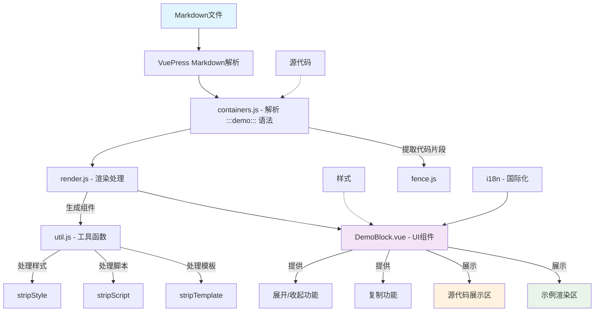

# 项目架构

## 概述

`vuepress-plugin-demo-container-v2.7` 是一个VuePress插件，用于在Markdown文档中创建演示块（demo blocks）。该插件允许用户在文档中嵌入可交互的Vue组件示例，并提供源代码展示和复制功能。

## 架构图

## 核心组件

### 1. src/index.js
插件的入口文件，配置VuePress的chainMarkdown和extendMarkdown钩子，注册容器和渲染处理。

### 2. src/common/containers.js
使用 `markdown-it-container` 插件来识别和处理 `::: demo ... :::` 语法块，将其转换为特定的HTML结构。

### 3. src/common/render.js
处理从Markdown中提取的演示代码，分离HTML模板、JavaScript脚本和CSS样式，并生成可渲染的组件。

### 4. src/common/util.js
提供工具函数，如：
- `stripScript`: 提取并处理脚本部分
- `stripStyle`: 提取并处理样式部分
- `stripTemplate`: 提取并处理模板部分
- `genInlineComponentText`: 生成内联组件文本

### 5. src/DemoBlock.vue
演示块的UI组件，提供：
- 示例渲染区域
- 源代码展示区域
- 展开/收起功能
- 代码复制功能
- 国际化支持

### 6. src/i18n/default_lang.json
提供多语言支持的配置文件。

## 工作流程

1. **解析阶段**：VuePress解析Markdown文件时，`containers.js` 识别 `::: demo ... :::` 语法块
2. **提取阶段**：从语法块中提取演示内容和描述信息
3. **处理阶段**：`render.js` 处理提取的内容，分离模板、脚本和样式
4. **生成阶段**：生成内联Vue组件并注册到页面组件中
5. **渲染阶段**：`DemoBlock.vue` 组件渲染最终的演示块界面

## 特性

- 支持在Markdown中嵌入Vue组件示例
- 提供源代码展示和隐藏功能
- 支持代码复制到剪贴板
- 响应式设计
- 国际化支持
- 可定制的样式和行为选项