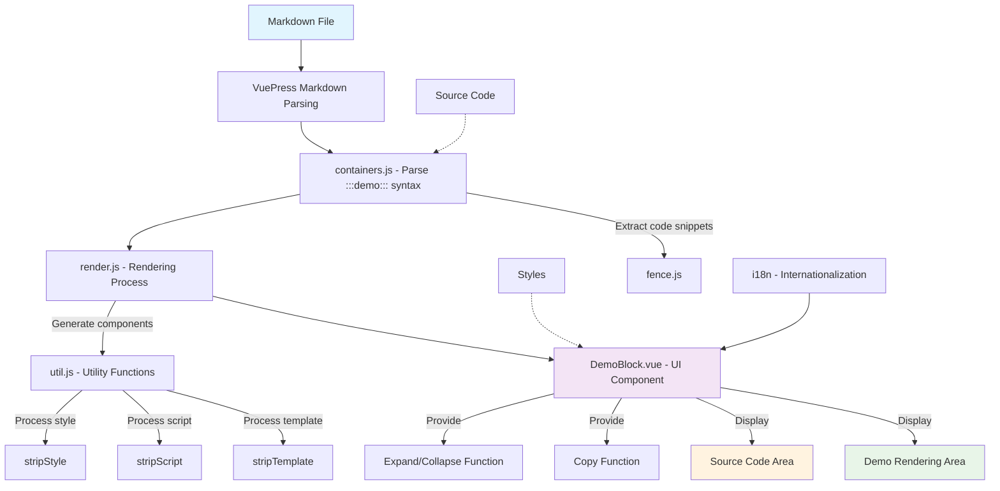

# Project Architecture

## Overview

`vuepress-plugin-demo-container-v2.7` is a VuePress plugin for creating demo blocks in Markdown documents. This plugin allows users to embed interactive Vue component examples in documentation and provides source code display and copy functionality.

## Architecture Diagram

## Core Components

### 1. src/index.js
The entry file of the plugin, which configures VuePress's chainMarkdown and extendMarkdown hooks to register containers and rendering processing.

### 2. src/common/containers.js
Uses the `markdown-it-container` plugin to identify and process `::: demo ... :::` syntax blocks, converting them into specific HTML structures.

### 3. src/common/render.js
Processes the demo code extracted from Markdown, separates HTML templates, JavaScript scripts, and CSS styles, and generates renderable components.

### 4. src/common/util.js
Provides utility functions, such as:
- `stripScript`: Extract and process script parts
- `stripStyle`: Extract and process style parts
- `stripTemplate`: Extract and process template parts
- `genInlineComponentText`: Generate inline component text

### 5. src/DemoBlock.vue
The UI component for the demo block, providing:
- Demo rendering area
- Source code display area
- Expand/collapse functionality
- Code copy functionality
- Internationalization support

### 6. src/i18n/default_lang.json
Configuration file for internationalization support.

## Workflow

1. **Parsing Phase**: When VuePress parses Markdown files, `containers.js` identifies `::: demo ... :::` syntax blocks
2. **Extraction Phase**: Extract demo content and description information from the syntax blocks
3. **Processing Phase**: `render.js` processes the extracted content, separating templates, scripts, and styles
4. **Generation Phase**: Generate inline Vue components and register them in the page components
5. **Rendering Phase**: The `DemoBlock.vue` component renders the final demo block interface

## Features

- Support for embedding Vue component examples in Markdown
- Source code display and hide functionality
- Copy to clipboard support
- Responsive design
- Internationalization support
- Customizable style and behavior options